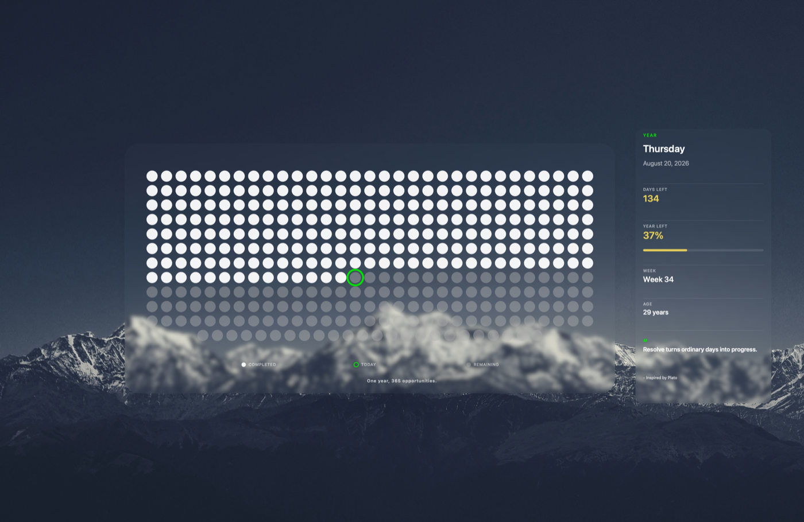

# Life Dots Wallpaper

A private SwiftUI macOS utility that renders and applies a one-year day-dot wallpaper.

## Download

> Requires Apple Silicon Mac (M1 or later). On first launch, right-click the app → **Open** to bypass the macOS security prompt.

## Preview

## Included

- Proper native macOS application target
- Visible `Products/LifeDotsWallpaper.app` build product
- Ad-hoc local signing (`Sign to Run Locally`)
- MacBook Air M4 13-inch canvas preset (2940 × 1912 pixels / 1470 × 956 points)
- Centre-aligned 365/366-day dot grid
- Completed, current and remaining-day styling
- Days-left number and percentage using a green-to-red annual gradient
- DOB, age and birthday countdown
- 365 concise offline motivational lines
- Daily 6:00 AM LaunchAgent
- No network access, telemetry or subscription

The app writes the generated PNG to:

`~/Pictures/LifeDotsWallpaper/`
